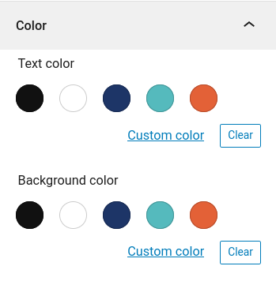
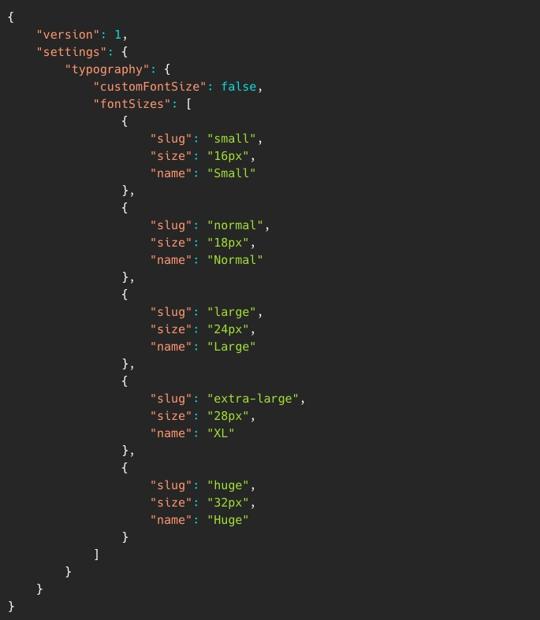

# Full Site Editing + Temas Basados en Bloques
### WordCamp Nicaragua 2021

---

### https://wcnicaragua.gatsbyjs.io/

Usa las teclas para navegar la presentacion.

---

> ## El WordPress del Futuro

La Version WP. 5.8 nos presenta un nuevo mecanismo para configurar el editor, el `theme.json`, un primer paso en la gestión de estilos para futuras versiones de WordPress, pero también da un vistazo a una nueva forma de construir sitios web al traer las primeras características que caen dentro del proyecto más amplio conocido como **Full Site Editing (FSE)**.

---

# ¿Que es el theme.json?

El archivo theme.json proporciona una forma canónica de definir la configuración del editor de bloques. Esta configuración incluye cosas como:

- Qué opciones de personalización deben estar disponibles u ocultas para el usuario.
- Cuáles son los colores predeterminados, tamaños de fuente.. etc, disponibles para el usuario.
- Define el diseño predeterminado del editor (anchos y alineaciones).

---

> ## Por Ejemplo:

Si deseas crear tus propios colores específicos del tema, puede especificarlos en el archivo `theme.json` de esta manera:

---

> ## ¿Qué hace theme.json?

WordPress lee el archivo theme.json y genera un conjunto de propiedades CSS que se agrega a cada página. Para el ejemplo de colores, creará una propiedad (variable) personalizada de CSS y clases de utilidad basadas en el slug especificado.

Para el ejemplo azul oscuro sería:

---

> Cuando usas un color en el editor de bloques, por ejemplo, cuando estableces el color de fondo en un párrafo, el editor agregará la clase has-dark-blue-background. Esto es lo que se guarda en el contenido de la publicación y se ejecuta cuando se ve.

---

## Tipografía

 Al igual que con los colores, puede especificar la configuración para los tamaños de fuente, de la misma manera puede deshabilitar a los usuarios para que no especifiquen su propio tamaño de fuente personalizado, esto hace que sea más fácil tener una tipografía consistente en todo el sitio.

---

> ## Usar propiedades en elementos o bloques

> La configuración (`settings`) es una propiedad superior del `theme.json`, otra son los estilos que le permiten especificar estilos para bloques o elementos.

---

Un ejemplo de configuración del margen y el color de los bloques de cita (`blockquote`):

Esto producirá el siguiente CSS:

---

> ### El nuevo formato para definir configuraciones y estilos de una manera estructurada realmente configura WordPress para un futuro brillante.

