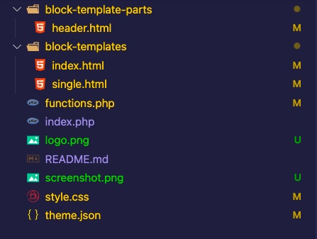
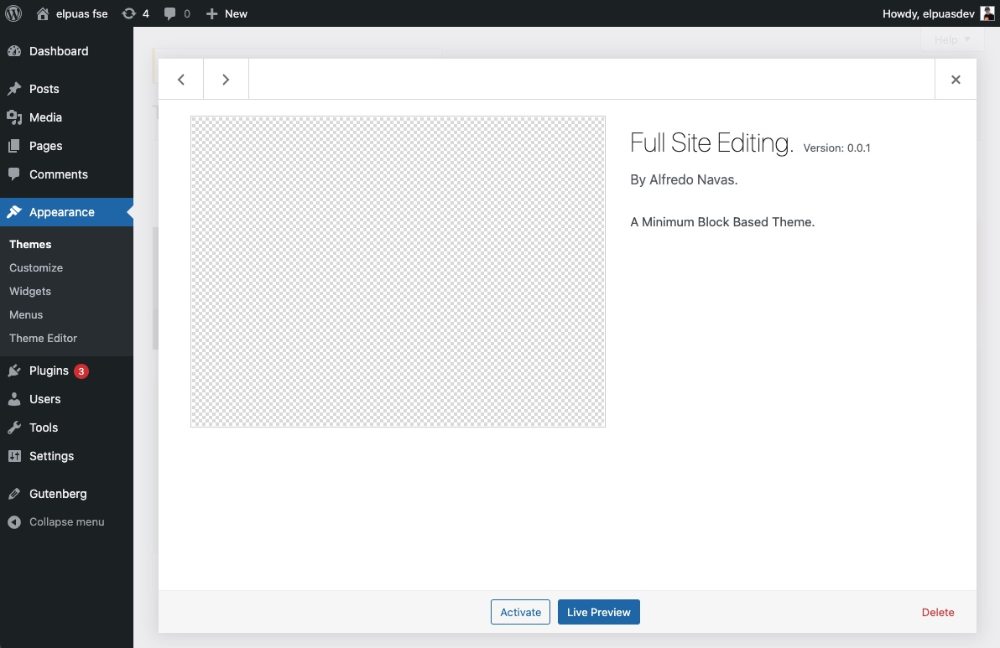
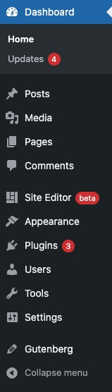
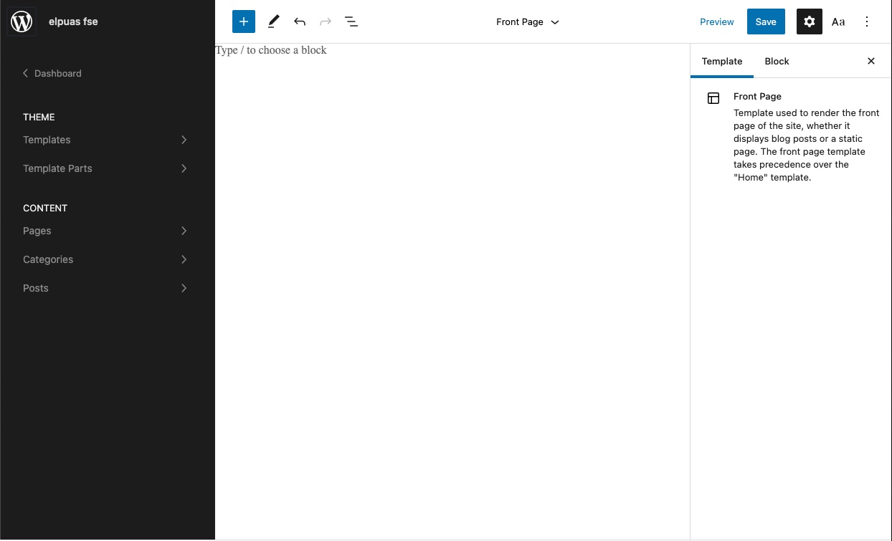
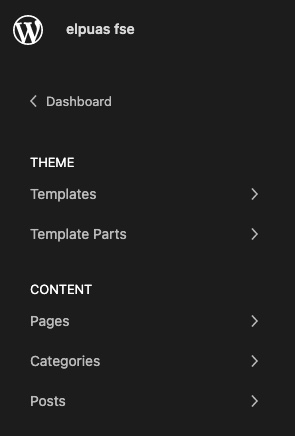
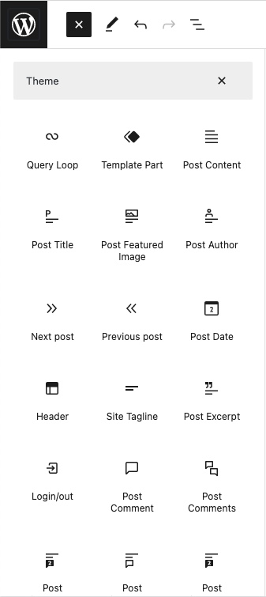
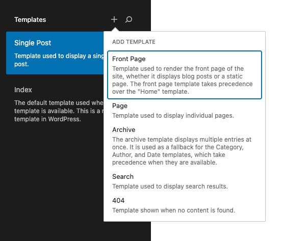
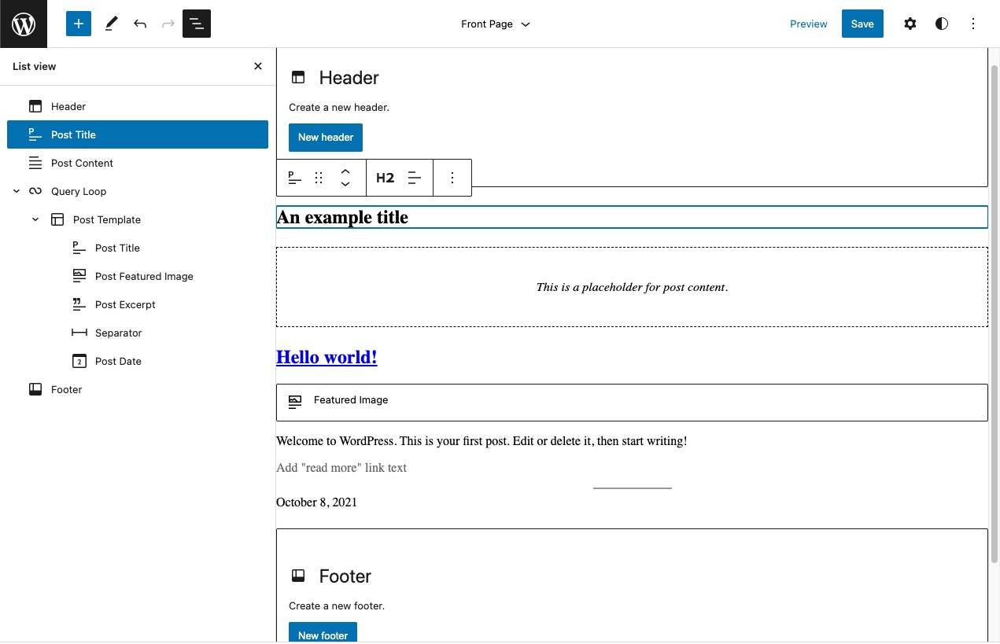
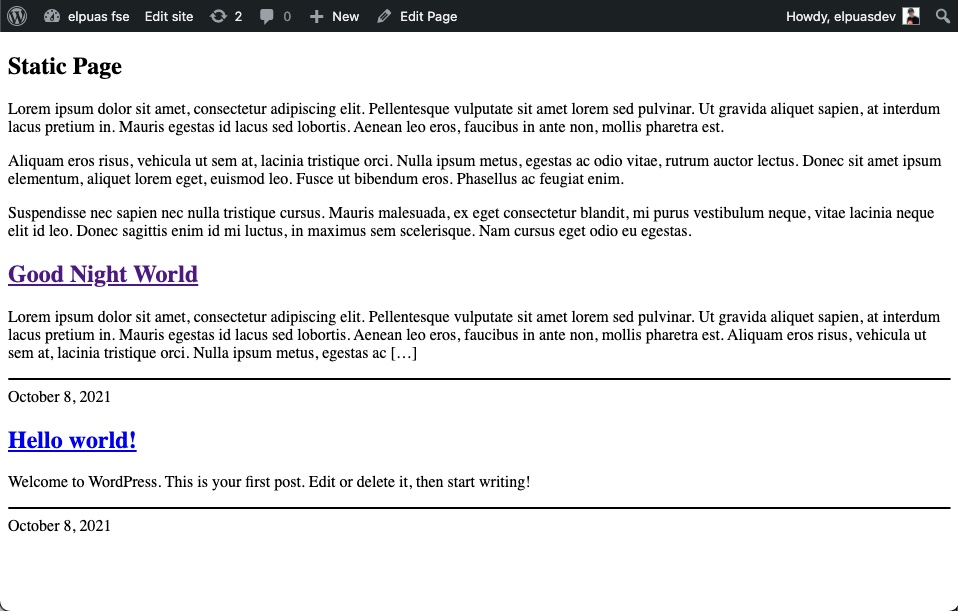

# Temas Basados en Bloques

---

Uno de los aspectos más interesantes de FSE son los [Temas Basados en Bloques](https://developer.wordpress.org/block-editor/how-to-guides/themes/block-theme-overview/), todas las partes previamente creadas dinámicamente de un tema, como el título del sitio, la leyenda del sitio, la navegación y los widgets, se han convertido en bloques.

Podemos utilizar bloques de Gutenberg para crear nuestro sitio web completo y ya no solo una página o post.

---

> ## Requerimientos Minimos
Activar el **FSE** consta de 3 sencillos pasos.

- WordPress 5.8
- El plugin de Gutenberg
- Tema basado en bloques

Antes de poder usar el editor del sitio para crear nuevas plantillas, es necesario instalar y activar un [Tema basado en bloques](https://github.com/elpuas/full-site-editing).

---

> ## Tema Basico

- Una carpeta del tema dentro de `wp-content/themes`.
- Un archivo `style.css`.
- Un archivo `functions.php` en blanco.
- Un archivo `index.php` en blanco.
- Dos carpetas nuevas en la raiz del tema: `block-templates` y `block-template-parts`.
- Dentro de la carpeta `block-template-parts`, Un archivo HTML vacío llamado `header.html`.
- Dentro de la carpeta `block-templates`, Un archivo HTML vacío llamado `index.html`.

---

Los Temas basados en Bloques utilizan el archivo [style.css](https://developer.wordpress.org/themes/basics/main-stylesheet-style-css/) estándar.

Los temas no requieren el archivo `functions.php` para funcionar. solo si necesitamos incluir otros assets, o funciones que **FSE** aún no puede hacer.

Sin un archivo `index.php` en blanco dentro de la carpeta del tema, WordPress considerará que el tema está roto.

Para que Gutenberg y WordPress reconozcan que el tema activo es compatible con **Full Site Editing (FSE)**, el tema debe incluir un archivo `index.html` y debe colocarse dentro de la carpeta `block-templates`.

Aunque no es obligatorio, los `block-template-parts` ayudan a estructurar el tema con partes más pequeñas reutilizables. Por ejemplo, para temas basados en bloques, `/block-template-parts/header.html` es el equivalente de `header.php` visto en temas clásicos.

---

> ## Activar el Tema

Antes de realizar los siguientes pasos, el [Plugin de Gutenberg](https://wordpress.org/plugins/gutenberg/) debe estar habilitado.

En el editor y activemos nuestro tema. En `Apariencia => Temas` y allí tenemos nuestro nuevo tema basado en bloques. Hacemos click en el botón activar.

---

> # Full Site Editing

---

> ## El Administrador

---

> ## El Admin FSE:

> El administrador del FSE:

- **Templates** - Manejamos las plantillas globales como index, front page, single... etc.
- **Template Parts** - Manejamos los plantillas como header, footer o sidebar.
- **Pages** - Podemos asignar bloques personalizados a cada pagina
- **Categories** - Podemos asignar bloques personalizados a cada categoria
- **Posts** - Podemos asignar bloques personalizados a cada post

---

> ## Bloques Disponibles:

> Algunos bloques son:

- Query Loop - Bucle de consulta
- Post Title - Título de la entrada
- Template Part - Parte de plantilla
- Navigation - Navegación
- Header - Encabezado
- Footer - Pie de página

---

> ## Mi Primer Template

El archivo front-page se utiliza para representar la página principal del sitio, ya sea que la página principal muestre el índice de publicaciones del blog o una página estática.

---

> ## En el editor

---

> ## Resultado

---

El resultado está bien, quiero decir que fue muy fácil agregar bloques, maxime si estas familiarizado con el editor de Gutenberg, ya tengo una página de inicio creada con algo de contenido y se seleccionó como página estática, sin haber escrito una sola línea de código y sin ningun tipo de estilos, usando solo el editor.

---

Usando el theme.json y el Full Site Editor podemos crear temas desde el editor de WordPress, sin escribir mucho o nada de codigo, si estan familiarizados con el Headless WordPress, podemos crear estructuras simples para crear contenido y consumir la data en un frontend desacoplado.

> ## El Futuro de WordPress ya esta aqui

